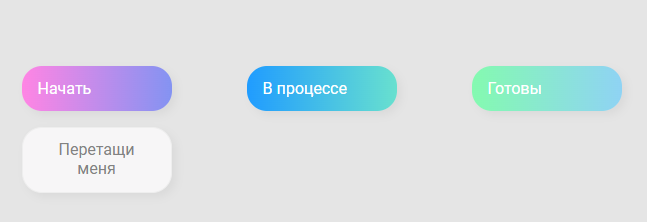

# Mini Trello drag and drop challenge

The task is to learn all drag and drop events.

### Useful code chunks

#### This is to hide an item while it is being dragged 

```javascript

const dragstart = e => {
    e.target.classList.add('hold')
    setTimeout(() => {
        e.target.classList.add('hide')
    }, 0)
}
```

#### Drag events used 
dragstart, dragend, dragover, dragenter, dragleave, drop

### Screenshot

